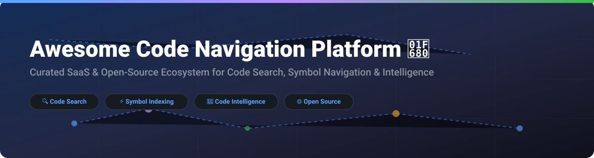

# Awesome Code Navigation Platform 🚀

  
  
  
  
  

## 📌 Ecosystem Overview & Key Features

Welcome to the ultimate curated list of **Code Navigation Platforms**, **Code Search Engines**, and **Code Intelligence Ecosystems**! 🧭

Whether you are managing large enterprise monorepos, indexing open-source software, or building developer experience (DevEx) infrastructure, this guide covers both **SaaS platforms** and **Open-Source GitHub repositories** focused on symbol cross-referencing, semantic code search, syntax-aware AST parsing, and AI coding assistants. ⚡

### 💡 Why Code Navigation Matters
- **Fast Code Discovery**: Instantly regex-search or symbol-search across millions of lines of code and multi-repo organizations.
- **Deep Symbol Navigation**: Jump to definition, find references, inspect call graphs, and understand dependencies seamlessly.
- **Developer Productivity**: Reduce onboarding time for new engineers and streamline code reviews and architectural audits.

---

## 📑 Table of Contents
- [🏢 SaaS & Hosted Platforms](#-saas--hosted-platforms)
- [🔓 Open-Source GitHub Projects](#-open-source-github-projects)
- [🛠️ How to Contribute](#️-how-to-contribute)
- [⚠️ Disclaimer](#️-disclaimer)
- [📈 Star History](#-star-history)
- [☕ Support & Sponsorship](#-support--sponsorship)

---

## 🏢 SaaS & Hosted Platforms

### 📊 Market Size & Industry Structure
> 💡 **Market Size & Structure**: The global Developer Tools and Code Intelligence market is estimated at **$22.5 Billion** (with Code Search & Navigation representing ~$3.2B). The sector is **moderately fragmented** but transitioning toward a **winner-take-most** consolidation model, driven by AI context integration (e.g. GitHub Copilot/Blackbird and Sourcegraph Cody).

### 🏆 SaaS Platforms Comparison Table
*(Sorted by Company Size / Market Valuation descending)*

| Platform 🚀 | Description 📝 | Company Size / Valuation 💰 | Starting Pricing Tier 🏷️ | Free Tier / Trial Limits ⏳ |
| :--- | :--- | :--- | :--- | :--- |
| **[GitHub Blackbird](https://github.com/search)** | Next-gen code search engine built in Rust indexing 180M+ repos and 480TB+ code with regex, symbol navigation, and precise qualifiers. | **$100B+** (Subsidiary of Microsoft) | **$4/user/month** (GitHub Team) | **Free Plan**: Free for public & personal private repos with standard search capabilities. |
| **[Sourcegraph](https://sourcegraph.com/)** | Enterprise code intelligence platform providing multi-repo code search, batch changes, and deep AST symbol cross-referencing. | **$2.6 Billion** (Valuation) | **$19/user/month** (Enterprise Starter) | **14-Day Free Trial** (Custom enterprise onboarding available upon request). |
| **[Qodo](https://www.qodo.ai/)** | AI-driven code integrity and governance platform with code review, symbol search, and test generation capabilities. | **$280 Million** (Valuation) | **$30/month** (Pro Team Base Plan) | **14-Day Free Trial** (Full features, credit-metered; free for popular OSS repos). |
| **[Cody](https://sourcegraph.com/cody)** | Sourcegraph's AI coding assistant powered by multi-repo code search index for context-aware autocomplete and agentic chat. | **$2.6 Billion** (Sourcegraph Product) | **$59/user/month** (Cody Enterprise) | **No perpetual free tier** (Requires Enterprise subscription or trial). |
| **[CodeSee](https://www.codesee.io/)** | Codebase visualization and interactive architecture mapping platform for developer onboarding. | **$25M - $50M** (Acquired by GitKraken in 2024) | **$15/user/month** (GitKraken DevEx Suite) | **14-Day Free Trial** via GitKraken DevEx platform. |
| **[Krugle](https://www.krugle.com/)** | Enterprise code search and agentic AI platform for legacy codebases and unstructured software archives. | **$7.3 Million** (Total VC Funding) | **$12/user/month** (Krugle Enterprise On-Prem) | **30-Day Free Trial** (Up to 5 seats & 500k lines of indexed code). |
| **[grep.app](https://grep.app/)** | Ultra-fast web search engine for public GitHub repositories with instant regex and case-sensitive matching. | **Bootstrapped / Independent** | **$0** (Community Free Service) | **100% Free** for all public repository searches (No account needed). |

---

## 🔓 Open-Source GitHub Projects

Explore production-ready open-source engines, AST parsers, and trigram search tools for self-hosting your own code search infrastructure.

*(Sorted by GitHub Star Count descending)*

| Project 🌟 | GitHub Stars ⭐ | License 📜 | Description & Key Features 🔑 |
| :--- | :---: | :---: | :--- |
| **[Tree-Sitter](https://github.com/tree-sitter/tree-sitter)** |  | MIT | **Parser generator tool & incremental parsing library.** Builds concrete syntax trees for source files to enable lightning-fast symbol navigation and syntax highlighting in IDEs and code search engines. |
| **[CodeQL](https://github.com/github/codeql)** |  | MIT License / Terms | **Discover vulnerabilities across codebases.** GitHub's semantic code analysis engine that lets you query code as data for security analysis and deep data-flow navigation. |
| **[Flow](https://github.com/facebook/flow)** |  | MIT | **Static type checker for JavaScript.** Provides deep type inference and symbol reference graphs for large-scale JavaScript/React codebases. |
| **[Pyre Check](https://github.com/facebook/pyre-check)** |  | MIT | **Performant type checker for Python.** Built by Meta in OCaml to provide fast symbol resolution, type analysis, and code navigation for multi-million line Python monorepos. |
| **[Hound](https://github.com/hound-search/hound)** |  | MIT | **Extremely fast trigram code search engine.** Go backend with React frontend. Keeps an up-to-date index of git/mercurial repos with minimal infrastructure footprint. |
| **[OpenGrok](https://github.com/oracle/opengrok)** |  | CDDL-1.0 | **Proven source code search and cross-reference engine.** Developed by Oracle. Provides definition lookup, identifier cross-referencing, and syntax highlighting for 60+ programming languages. |
| **[Kythe](https://github.com/kythe/kythe)** |  | Apache-2.0 | **Ecosystem for developer tools by Google.** Provides language-agnostic interoperability standards and indexers for build-system-level code navigation and cross-referencing. |
| **[Livegrep](https://github.com/livegrep/livegrep)** |  | BSD-2-Clause | **Interactive regex search for gigabyte-scale codebases.** Written in C++ and Go. Enables sub-second regex query responses across massive source trees. |
| **[Zoekt](https://github.com/sourcegraph/zoekt)** |  | Apache-2.0 | **Fast trigram-based search engine from Sourcegraph.** Powers exact code search in Sourcegraph and GitLab. Optimized positional trigram indexes for sub-millisecond regex execution. |
| **[Sourcebot](https://github.com/sourcebot-dev/sourcebot)** |  | MIT | **Modern self-hosted code search web UI.** Supports regex, AST symbol search, and multi-branch filtering with low memory requirements. |

---

## 🛠️ How to Contribute

Contributions are warmly welcomed! Help us keep this list comprehensive and up to date. ✨

1. **Fork** the repository.
2. Read our [awesome list guidelines](https://github.com/ishandutta2007/Awesome-Awesome-Awesome).
3. Add or update entries in `README.md` following the tabular formats above.
4. Open a **Pull Request** with a brief summary of additions.

---

## ⚠️ Disclaimer

- This list is **community-curated** for educational and architectural reference purposes.
- Product logos and brand names belong to their respective owners.
- **Open-Source Reality**: Open-source tools like **Zoekt**, **OpenGrok**, and **Tree-Sitter** are production-hardened and power massive internal infrastructure at companies like GitLab, Oracle, and GitHub.

---

## 📈 Star History

---

## ☕ Support & Sponsorship

Thank you for visiting and supporting the **Awesome Code Navigation Platform** project! If this list has saved you time or helped you select the right code navigation tool for your engineering team, please consider giving this repository a ⭐ **Star**, sharing it with fellow developers, or buying me a coffee! ☕

  

